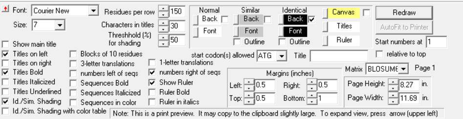

# 系统进化分析

## 数据
* 在data文件夹里有所需fasta文件，该文件包含“Discovery of a rich gene pool of bat SARSrelated coronaviruses provides new insights into the origin of SARS coronavirus”里所使用的所有序列；
* 文件可以通过NCBI的Batch Entrez下载批量序列的fasta文件，列表文件为accessions_list.seq

## 所需软件
* **[Clustalo](http://www.clustal.org/omega/), [SimPlot](https://sray.med.som.jhmi.edu/SCRoftware/simplot/), [MEGA-X](https://www.megasoftware.net/), [BioEdit](https://bioedit.software.informer.com/7.2/)**

## 多重序列比对(Multiple Sequence alignment)
* The identification of residue–residue correspondences. 
	* Clustalo:
		* Windows Subsystem for Linux (WSL): `clustalo -i input.fasta -o output.fas -v`

## 相似图(Similarity Plot)
* SimPlot:
	* 打开对齐后的fasta文件，使用空格分隔符使序列正常分组，SeqPage里可以指定SimPlot界面中使用的序列
	* 进入SimPlot选项卡，Commands->Query->指定query sequence;
	* 左下角进行Simplotd的参数设置（文献中：window size: 1500 bp, step size: 150 bp）;
	* 最后Commands->DoSimPlot 进行绘制;
	* 若对SimPlot生成的图像不满意，想进行调整，可以File->Save Chart Values as CSV 以导出坐标数据，使用其它软件画图

## 系统进化树(Plylogenetic tree)
* 系统进化树分析可以对多种类型的序列进行分析，在这里，我们重复文献中使用的ORF1a氨基酸序列的系统进化树分析
* MEGA-X:
	* 使用“Align”模式打开对齐后的fasta文件;
	* 根据 genbank 中 beta coronaviruses 的信息，ORF1a对应对齐后序列的272-13429 (with gaps)，删去其余部分，Translate 成氨基酸序列;
	* 然后Data->Phylogenetic Analysis将所选序列进行分析;
	* Phylogeny->Construct/Test Maximum Likelihood Tree:
		* 设定参数（Using the LG model with bootstrap values determined by 1000 replicates.）;
		* Wait (Can reduce the  number of boostrap replicates to save time while get the similar result.)

## 多重序列可视化
* BioEdit：
	以文献中显示S1亚基的文章为例。
	* 使用文本编辑器从原始的fasta文件中复制所需要的序列到新的文件夹，或使用BioEdit打开原始的fasta删去不需要的序列;
	* 然后使用clustalo重新进行多重序列比对;
	* 使用BioEdit打开对齐后的fasta文件，点击File->Graphic View->按照下图进行参数设定，最后print到pdf即可。
	
