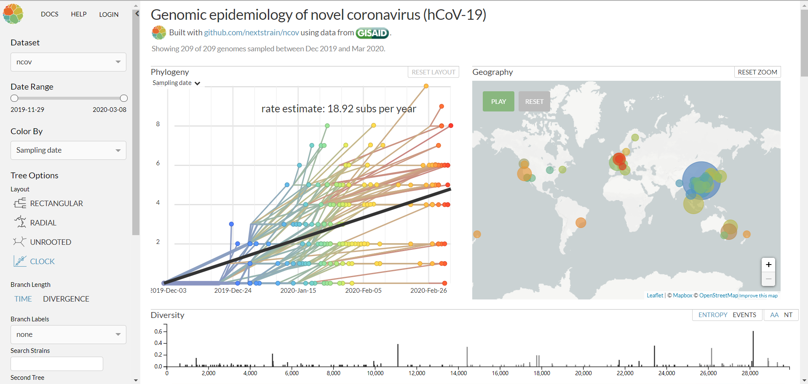

# 动态系统进化分析
## 例1
<center>

<br>
<div style="color:orange; border-bottom: 1px solid #d9d9d9;
display: inline-block;
color: #999;
padding: 1px;">Genomic epidemiology of novel coronavirus ( 2020-03-08 02:45 )</div>
</center>

以Nextstrain官网上展示的Genomic epidemiology of novel coronavirus为例，使用Augur以及Auspice利用网上开放的新冠序列进行一次简单的模仿。

* 所需数据：
	- **data/phylodynamic_2019nCoV0307.fasta**：国家生物信息中心中下载的公开发布的序列
	- **data/phylodynamic_metadata0307.tsv**：国家生物信息中心中下载的所有序列的元数据，已经过数据整理及清洗
	- **data/phylodynamic_lat_longs.tsv**：在地图上标定位置所需要的经纬度信息
	- **data/phylodynamic_auspice_config.json**：auspice绘制网页时设定的参数
	- **data/phylodynamic_exclude.txt**：QC不合格的sequence序列列表，可选

* 所需软件: **[Augur](https://nextstrain.org/docs/bioinformatics/introduction-to-augur/), [Auspice](https://nextstrain.org/help/general/interacting-with-nextstrain)**

* 代码：

```
cd .. # 使得目录在Github根目录下
exclude="data/phylodynamic_exclude.txt"
reference="data/phylodynamic_reference.gb"
auspice_config="data/phylodynamic_auspice_config.json"
lat_longs="data/phylodynamic_lat_longs.tsv"
sequences="data/phylodynamic_2019nCoV0307.fasta"
metadata="data/phylodynamic_metadata0307.tsv"

# filter
augur filter \
	--sequences $sequences \
	--metadata $metadata \
	--exclude $exclude \
	--output results/filtered.fasta \
	--group-by "Country" \

# align
augur align \
	--sequences results/filtered.fasta \
	--reference-sequence $reference \
	--output results/aligned.fasta \
	--fill-gaps \
	--remove-reference

# tree
augur tree \
	--alignment results/aligned.fasta \
	--output results/tree_raw.nwk

# refine
augur refine \
	--tree results/tree_raw.nwk \
	--alignment results/aligned.fasta \
	--metadata $metadata \
	--output-tree results/tree.nwk \
	--output-node-data results/branch_lengths.json \
	--root BetaCoV/Wuhan/WH-01/2019 \
	--timetree \
	--clock-rate 0.0005 \
	--clock-std-dev 0.0003 \
	--coalescent skyline \
	--date-inference marginal \
	--divergence-unit mutations \
	--date-confidence \
	--no-covariance

# ancestral
augur ancestral \
	--tree results/tree.nwk \
	--alignment results/aligned.fasta \
	--output-node-data results/nt_muts.json \
	--inference joint

# translate
augur translate \
	--tree results/tree.nwk \
	--ancestral-sequences results/nt_muts.json \
	--reference-sequence $reference \
	--output-node-data results/aa_muts.json

# export
augur export v2 \
	--tree results/tree.nwk \
	--metadata $metadata \
	--node-data results/branch_lengths.json results/nt_muts.json results/aa_muts.json \
	--auspice-config $auspice_config \
	--lat-longs $lat_longs \
	--output results/res.json

```

* 结果查看：

```
cd .. # 使得目录在Github根目录下
auspice view --datasetDir results
# 在浏览器中输入 “http://localhost:4000” 后选择res数据集查看即可
```
### 结果分析

> **Under construction**

### 思考：
* 对齐序列时所使用的软件是什么？为什么选择该软件？
* 构建树时所使用的方法是？为什么使用该方法？
* Phylodynamic 分析与普通的 Phylogenetics tree 构建有什么区别？
* 制作出的结果与Nextstrain上的有什么区别？可能的原因有什么？

## 例2
> **Under construction**

- - -

> 参考资料：
[Nextstrain build for novel coronavirus (nCoV)](https://github.com/nextstrain/ncov)
