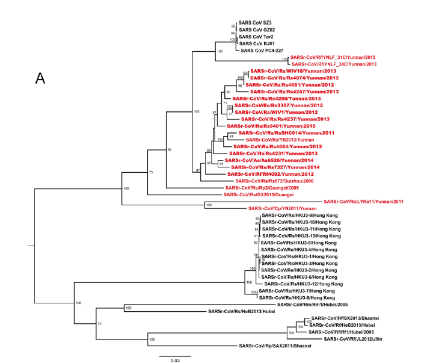

# 系统进化树构建
构建系统进化树的程序有很多，具体可以查看[Phylogeny Program](http://evolution.genetics.washington.edu/phylip/software.html)(非最新)。系统进化树构建程序的选择最主要的是里面包含的分类方法，其次是速度以及编辑性。对于新手来说，使用MEGA就能够方便的进行一次系统进化树的构建。在我目前看到有使用的软件还有[PHYLIP](http://evolution.genetics.washington.edu/phylip/getme-new1.html)、[IQ-tree](http://www.iqtree.org/)。
## 例1
在这里，我们使用文献中[“Discovery of a rich gene pool of bat SARSrelated coronaviruses provides new insights into the origin of SARS coronavirus”](https://www.ncbi.nlm.nih.gov/pmc/articles/PMC5708621/)使用的ORF1a氨基酸序列重复一次文献中所用的系统进化树。

* 所需数据：**"data/tree_ORF1a.fas"**

* 所需软件：[**MEGA-X**](https://www.megasoftware.net/)

* MEGA-X：
	* 使用“Analyze”模式打开对齐后的fasta文件，选择序列为核酸序列，且为蛋白编码的核酸序列;
	* 核酸翻译使用标准模型;
	* 然后Data->Phylogenetic Analysis将所选序列进行分析;
	* Phylogeny->Construct/Test Maximum Likelihood Tree:
		* 设定参数（文献参数：使用氨基酸作为替代单位，使用LG model模型，进行bootstrap检验1000次重复），其它可默认;
	* Wait (需要一定的时间，可以减少重复次数以节约时间)

* **思考：**
	- 生成的树与文献上的树有什么不同？可能原因有什么？
	- MEGA里可以通过其它方法构建树，试试使用UPGMA、Neighbour-joining、Maximun parsimony构建相同序列的phylogenetic tree，并看看方法之间有什么区别？

