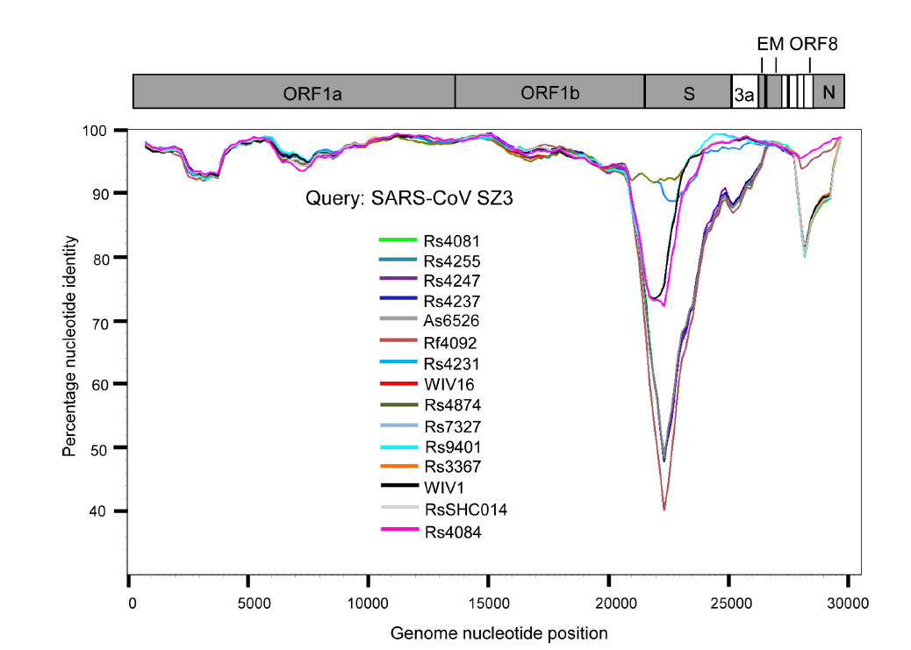
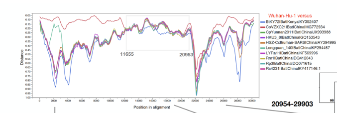

# 相似图/差异图(Similarity Plot / Devisity Plot)
## 例1

以文献[“Discovery of a rich gene pool of bat SARSrelated coronaviruses provides new insights into the origin of SARS coronavirus”](https://www.ncbi.nlm.nih.gov/pmc/articles/PMC5708621/)中的Figure 1的相似图为例重复。

* 数据：**data/simplot_example1.fasta**

* 所需软件：**[SimPlot](https://sray.med.som.jhmi.edu/SCRoftware/simplot/) v3.5.1**

* 步骤：
	* 打开对齐后的fasta文件，使用空格分隔符使序列正常分组，SeqPage里可以指定SimPlot界面中使用的序列
	* 进入SimPlot选项卡，Commands->Query->指定query sequence;
	* 左下角进行Simplot的参数设置（文献中：window size: 1500 bp, step size: 150 bp）;
	* 最后Commands->DoSimPlot 进行绘制;
	* 若对SimPlot生成的图像不满意，想进行调整，可以File->Save Chart Values as CSV 以导出坐标数据，使用其它软件画图

## 例2

以学者David在Virological发表的帖子“[nCoV’s relationship to bat coronaviruses & recombination signals (no snakes)](http://virological.org/t/ncovs-relationship-to-bat-coronaviruses-recombination-signals-no-snakes-no-evidence-the-2019-ncov-lineage-is-recombinant/331)”为例，重复其中的差异图

* 数据：**data/simplot_example2.fasta**

* 所需软件：**[RDP](http://web.cbio.uct.ac.za/~darren/rdp.html)5**(Recombination Detection Program version 5)

* 步骤：
	* 打开对齐后的fasta文件，在这里我们可以看到fasta的序列以及序列相似度的信息;
	* 进入选项卡，Run->Manual distance Plot-> 指定Potential Recombinant Sequence为新冠病毒序列（MN908947.1）;
	* 点击Options设定参数（Windows size: 800, Step size:50; 距离模型一般使用Kimura模型）;
	* 设置好参数后返回点击OK即可进行差异图的绘制;
	* 右上角可以更改序列的颜色；同样，若对SimPlot生成的图像不满意，可以右键图像导出坐标数据为CSV文件以使用其它软件画图
