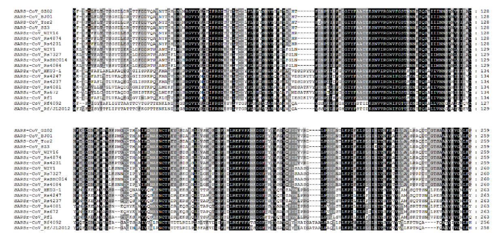
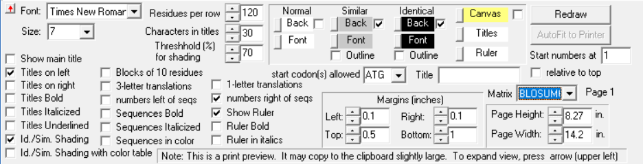
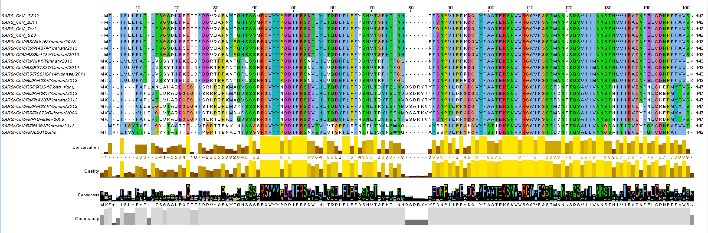

# 多重序列可视化
我们以文献[“Discovery of a rich gene pool of bat SARS-related coronaviruses provides new insights into the origin of SARS coronavirus”](https://www.ncbi.nlm.nih.gov/pmc/articles/PMC5708621/)中的Figure 3为例重复多种不同的可视化方法。
* 数据：**data/visualizations_1.fasta**

## 例1

* 所需软件：[**BioEdit**](https://bioedit.software.informer.com/7.2/)
* BioEdit：
	* 使用BioEdit打开的visualizations_1.fasta，点击File->Graphic View->按照下图进行参数设定，参数设定后Redraw重新绘制图像；可以根据需要修改参数自行调整图像；若确保图像已符合具体要求，则可以进入Eidt->Copy Page as... ，推荐使用Enhanced Windows Metafile格式，图像更加清晰。不推荐使用print功能，页面调整太麻烦。

## 例2

* 所需软件：[**Jalview**]
* Jalview v2.11.0:
	* 使用Jalview打开的visualizations_1.fasta，拉伸窗口至合适大小，点击Colour->ClustalX给氨基酸上色，右键Consensus点击Show Logo可以看见序列文字的可视化。点击File->Export Image，有多种格式可供导出。

- - -

> 参考资料：
[“Discovery of a rich gene pool of bat SARSrelated coronaviruses provides new insights into the origin of SARS coronavirus”](https://www.ncbi.nlm.nih.gov/pmc/articles/PMC5708621/)
