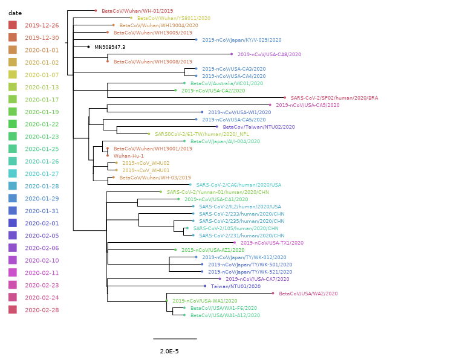

# 系统进化树可视化
我们以动态系统进化分析中产生的nwk tree文件来进行可视化的处理，虽然在动态进化分析里的里auspice里已经有了很好的可视化的功能，但是如果我们展示时需要通过一个网站呈现那么将会有些麻烦，下面我们将使用FigTree进行类似Auspice的可视化处理。
* 所需数据：
	- **results/tree.nwk**：用来存储树数据的Newick格式文件
	- **data/phylodynamic_metadata0307.tsv**：用来描述序列的元数据

## 例1

* 所需软件：[**FigTree**](http://tree.bio.ed.ac.uk/software/figtree/)
* FigTree v1.4.4：
	* 使用FigTree打开tree.nwk，使用默认lable导入标签
	* File->Import Annotations导入元数据文件
	* Tree->Annotate Notes from Tips, Tree->Annotate Tips from Notes 里导入需要的注释信息，如date或country等
	* 左侧将Legend功能打开，属性选择需要的注释信息
	* 将Tip Shapes功能打开，根据需要表现的注释信息上色
	* 其它功能大家可以自行选择以查看代表的是什么，根据需要展现
	* File-> Export，推荐导出为SVG格式

> **思考**：为什么MN908947.3的标签和点是黑色的？

## 例2
**待添加……**

- - -

